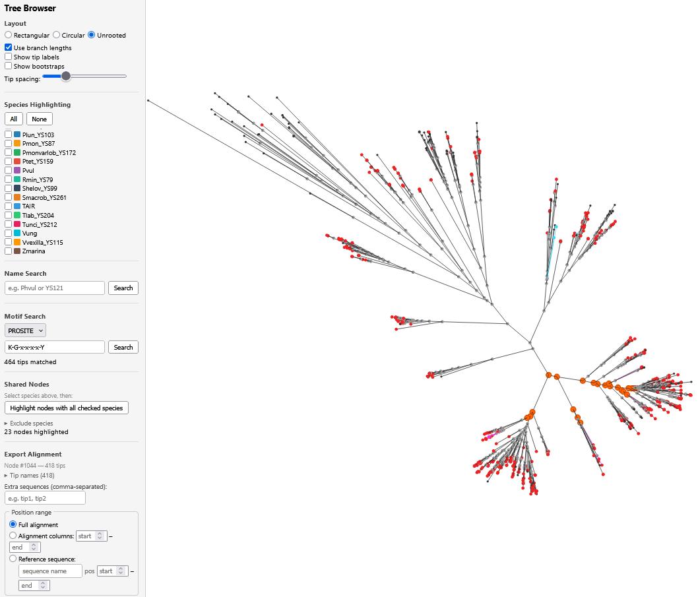

# Tree Browser

Interactive phylogenetic tree viewer. Built with FastAPI (Python) and vanilla JS/SVG.



## Installation

The app requires Python 3.10+ with **fastapi** and **uvicorn**.

### Option A: micromamba / conda (recommended)

```bash
# Install micromamba if you don't have it:
# Linux/WSL
curl -Ls https://micro.mamba.pm/api/micromamba/linux-64/latest | tar -xvj -C ~/.local/bin --strip-components=1 bin/micromamba
# macOS (Intel)
curl -Ls https://micro.mamba.pm/api/micromamba/osx-64/latest | tar -xvj -C ~/.local/bin --strip-components=1 bin/micromamba
# macOS (Apple Silicon)
curl -Ls https://micro.mamba.pm/api/micromamba/osx-arm64/latest | tar -xvj -C ~/.local/bin --strip-components=1 bin/micromamba

# Create the environment
micromamba create -f environment.yml -y
micromamba activate tree-browser
```

### Option B: pip

```bash
pip install fastapi uvicorn
```

### Option C: System packages

**Debian/Ubuntu/WSL:**
```bash
sudo apt install python3 python3-pip
pip install fastapi uvicorn
```

**macOS (Homebrew):**
```bash
brew install python
pip3 install fastapi uvicorn
```

**Windows (native):**
```powershell
# Install Python from https://www.python.org/downloads/ then:
pip install fastapi uvicorn
```

## Quick Start

```bash
cd browser
./run.sh
# or manually:
micromamba run -n tree-browser python3 app.py
# or without micromamba:
python3 app.py
```

Then open http://localhost:8000.

## Getting Started

On launch, a setup dialog prompts for an input folder path. You can type a path directly or click **Browse** to navigate the filesystem visually. The browser shows a green checkmark when the current directory contains valid input files, and the **Select** button fills the path for you.

## Input Folder Structure

Point the browser at any folder containing:

| File | Description |
|------|-------------|
| `*.nwk` | Newick tree (exactly one) |
| `*.aa.fa` | Gapped protein alignment (exactly one) |
| `orthofinder-input/*.fa` | Per-species FASTA files for tip-to-species mapping (optional) |

An example dataset is provided in `example_data/`.

## Features

### Tree Display
- **Three layouts**: rectangular, circular (polar), unrooted (Felsenstein equal-angle)
- **Branch lengths**: toggle phylogram vs cladogram
- **Tip labels**: toggle on/off; tips always show a small colored dot
- **Bootstrap values**: toggle display on internal nodes
- **Tip spacing**: adjustable via slider
- **Collapse/expand**: click an internal node dot to collapse its subtree
- **Pan and zoom**: mouse drag to pan, scroll wheel to zoom

### Species Highlighting
- Check species in the sidebar to color their tips (both labels and dots)
- Colors persist even when tip labels are hidden
- 40-color palette auto-assigned to species

### Name Search
- Regex search against tip names (case-insensitive)
- Matched tips highlighted in blue on the tree
- Up to 10 matching names listed below the search box

### Motif Search
- Search protein sequences by regex or PROSITE pattern
- Matched tips highlighted in red on the tree

### Shared Nodes
- Select species, then highlight all internal nodes containing all checked species
- Optional species exclusion filter (nodes must not contain excluded species)

### Alignment Export
- **Shift-click** an internal node to select it for export
- Exports gapped FASTA for the subtree's sequences (in tree traversal order)
- Options:
  - **Extra sequences**: add comma-separated tip names (validates they exist)
  - **Full alignment**: export all columns
  - **Alignment columns**: specify a 1-indexed column range
  - **Reference sequence positions**: specify residue positions in a reference sequence; automatically maps to alignment columns

## API Endpoints

| Endpoint | Description |
|----------|-------------|
| `GET /api/browse?path=...` | List subdirectories, detect valid input files |
| `POST /api/load` | Load an input folder (`{"input_dir": "..."}`) |
| `GET /api/status` | Check if data is loaded |
| `GET /api/tree` | Full tree as JSON |
| `GET /api/species` | Species list and species-to-tips mapping |
| `GET /api/motif?pattern=...&type=regex` | Motif search (regex or prosite) |
| `GET /api/nodes-by-species?species=X&exclude=Y` | Find nodes with required/excluded species |
| `GET /api/node-tips?node_id=N` | List descendant tip names for a node |
| `GET /api/tip-names` | All tip names (for autocomplete) |
| `GET /api/export?node_id=N&...` | Download gapped FASTA for a subtree |

### Export Parameters

| Parameter | Description |
|-----------|-------------|
| `node_id` | Required. Internal node ID |
| `extra_tips` | Optional. Additional tip names (repeatable) |
| `col_start`, `col_end` | Optional. 1-indexed alignment column range |
| `ref_seq` | Optional. Reference sequence name |
| `ref_start`, `ref_end` | Optional. 1-indexed residue positions in the reference |

## Project Structure

```
environment.yml     # Conda/micromamba environment spec
browser/
  app.py            # FastAPI backend
  run.sh            # Launch script
  static/
    index.html      # Single-page app
    app.js          # All client-side logic
    style.css       # Styling
example_data/       # Example tree, alignment, and species data
```
