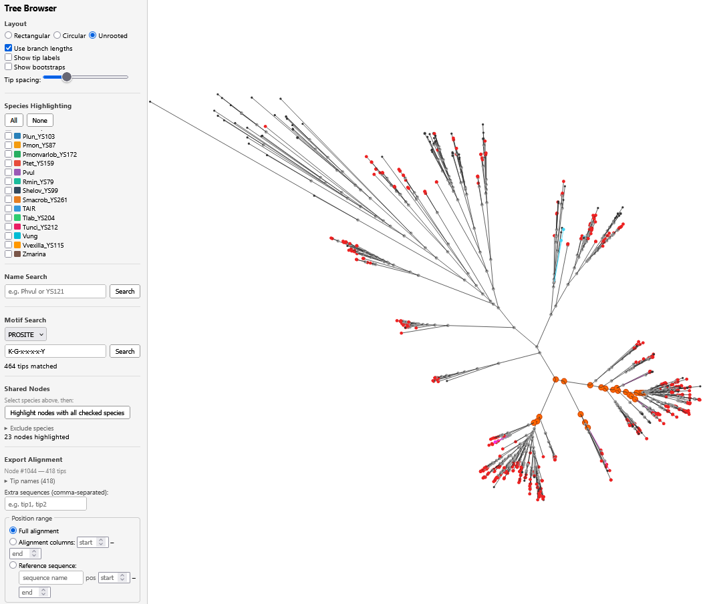

<p align="left">
  
</p>

# PhyloScope

A lightweight, local-first phylogenetic tree viewer with built-in sequence tools. Runs entirely in the browser — no server, no install required.

The frontend is organized as small ES modules under `src/static/js/`, bundled into a single distributable folder (`docs/`) via esbuild.



## How it compares

| Feature | PhyloScope | iTOL | FigTree | ETE Toolkit | Dendroscope |
|---|---|---|---|---|---|
| Hosting | Local, standalone HTML | Cloud (freemium) | Desktop (Java) | Python library | Desktop (Java) |
| Species coloring | Built-in from FASTA inputs | Manual annotation files | Manual | Programmatic | Manual node/edge formatting |
| Motif search | Regex + PROSITE, multi-motif with per-motif colors | No | No | Programmatic | No |
| Shared node finding | Built-in species filter with exclusion | No | No | Scriptable | No |
| Alignment export | Click-to-copy FASTA, subtree slicing, column ranges | No | No | Scriptable | No |
| Click-to-copy | Tip FASTA + node aligned FASTA to clipboard | No | No | No | No |
| Annotation | Species, bootstrap, motif highlights, sequence lengths, clade labels | Very rich (heatmaps, domains, bars) | Moderate | Very rich | Basic (colors, fonts, line widths) |
| Large trees (10k+) | Fast mode: batched SVG, auto-collapse, render cache | Optimized for large trees | Moderate | Good | Optimized (magnifier tool) |
| Undo/redo | Full undo/redo for tree operations | No | Limited | No | No |
| Session persistence | Save/load all UI state + data to JSON | Server-side projects | Save to NEXUS | Scriptable | Save to file |
| Tip filtering | Regex and species-based hide/show | Dataset filtering | Taxon filtering | Programmatic | Find/filter |
| Pairwise comparison | Patristic distance + sequence identity | No | No | Programmatic | No |
| PDF export | Vector PDF via jsPDF/svg2pdf | PNG/SVG/PDF | PDF/SVG/PNG | PNG/SVG/PDF | PDF/SVG/PNG |

## Quick Start

Open `docs/index.html` in any modern browser. That's it — no server, no install.

You can also serve it from any static file server (e.g. `python3 -m http.server -d docs`).

## Building from Source

If you want to rebuild the bundle after modifying source files:

```bash
cd browser
npm install    # one-time: installs esbuild
npm run build  # bundles to docs/
```

Requires Node.js 16+.

## Getting Started

On launch, a setup dialog lets you load your data:

- **Choose Folder**: select a folder containing your input files (uses the browser's folder picker)
- **Choose Files**: select individual files if folder picking isn't available in your browser
- **Load saved session**: restore a previously saved session file, which includes all data and UI state

After selecting files, PhyloScope detects and categorizes them. Choose the tree and alignment files from the dropdowns if multiple are present, then click **Load**.

## Input Folder Structure

Point PhyloScope at any folder containing:

| File | Description |
|------|-------------|
| `*.nwk` | Newick tree (exactly one, required) |
| `*.aa.fa` | Gapped protein alignment (optional) |
| `orthofinder-input/*.fa` | Per-species FASTA files for tip-to-species mapping (optional) |
| `dataset/*.txt` | Tab-delimited tip datasets for rectangular heatmap display (optional) |

An example dataset is provided in `example_data/`.

## Features

### Loaded Data Panel
- Shows currently loaded tree file (with tip count), alignment file, and species count at the top of the sidebar
- **Load different data** button resets all state and re-opens the setup dialog

### Tree Display
- **Three layouts**: rectangular, circular (polar), unrooted (Felsenstein equal-angle)
- **Branch lengths**: toggle phylogram vs cladogram
- **Tip labels**: toggle on/off (auto-hidden for trees >1000 tips); tips always show a small colored dot
- **Sequence lengths**: toggle to show ungapped amino acid length next to each tip label
- **Bootstrap values**: toggle display on internal nodes
- **Tip spacing**: adjustable via slider
- **Collapse/expand**: Shift+click an internal node to collapse its subtree into a triangle
- **Uniform triangles**: toggle to make all collapsed triangles the same size regardless of tip count
- **Triangle size**: adjustable via slider
- **Subtree focus**: Ctrl+click an internal node to view its subtree in isolation; click "Back to full tree" to return
- **Re-root**: Ctrl+Shift+click any node or tip to re-root the tree at that point
- **Pan and zoom**: mouse drag to pan, scroll wheel to zoom

### Fast Mode (Large Trees)
- Auto-enables for trees with >1000 tips; manual toggle available
- **Batched SVG rendering**: branches collapsed into single `<path>` elements per color, dots grouped — reduces DOM elements from ~5000-7000 to ~500-1500
- **Simplified tip dots**: single color per tip (no pie charts), no labels or bootstrap values
- **Render cache**: skips re-render when no relevant state has changed
- **Auto-collapse**: for trees >2000 tips, automatically collapses clades to show ~50 visible groups; shift-click to expand clades of interest

### Undo / Redo
- Full undo/redo for tree operations: re-root, collapse/expand, subtree focus, restore full tree
- **Keyboard shortcuts**: Ctrl+Z to undo, Ctrl+Shift+Z (or Ctrl+Y) to redo
- Buttons in the Subtree Focus section; stack capped at 20 entries

### Node Selection
- **Click** an internal node to select it — the node appears as a larger black dot with a red ring
- The aligned FASTA for the subtree is automatically copied to the clipboard
- The sidebar shows species counts per selected node, and motif entries show per-node match counts with matching sequence names

### Clade Labels
- Select a node, then type a label in the **Clade Labels** section to annotate it
- Labels display as bold text next to the node dot on the tree (and on collapsed triangles)
- Labels are included in SVG/PNG/PDF exports
- Labels persist across undo/redo and are saved/restored with sessions
- Small "x" button to remove individual labels

### Species Highlighting
- Check species in the sidebar to color their tips (both labels and dots)
- Species count badges appear next to each species name when a node is selected
- Colors persist even when tip labels are hidden
- 40-color palette auto-assigned to species

### Name Search
- Regex search against tip names (case-insensitive)
- Matched tips highlighted in blue on the tree
- Clickable results list — click a match to:
  - Highlight it with a large red circle on the tree (visible even inside collapsed clades)
  - Pan the view to center on the tip
  - Copy its name to the clipboard
- Warning shown when a tip exists in the tree but not in the alignment

### Motif Search
- Search protein sequences by **regex** or **PROSITE** pattern
- Syntax hints and examples shown for each mode
- Motifs accumulate into a running list — each entry shows:
  - Color swatch, pattern, total match count
  - Per-node match count and first 10 matching sequence names (when a node is selected)
  - Remove button to delete individual motifs
- Each motif gets a distinct color; tips matching multiple motifs display a **pie-chart dot** showing all matching colors
- Text labels use the first matching motif's color

### Tip Interaction
- **Hover** over a tip to see: species, amino acid length, matching motif patterns, and click hints
- **Click** a tip to copy its name to the clipboard
- **Shift+click** a tip to copy its ungapped FASTA sequence to the clipboard

### Shared Nodes
- Select species, then highlight all internal nodes containing all checked species
- Optional species exclusion filter (nodes must not contain excluded species)
- Clickable list of matching nodes — click to select and pan to the node

### Tip Filtering
- **Hide by regex**: enter a pattern to hide all matching tips from the tree
- **Hide unchecked species**: hide all tips belonging to unchecked species
- **Show all**: reset to show all tips
- Badge shows how many tips are currently hidden
- Filtering is instant and reversible — hidden tips are visually removed from the layout but remain in the underlying data
- Works across all three layout modes

### Pairwise Compare
- Select two tips (with autocomplete) and click **Compare** to see:
  - **Patristic distance**: sum of branch lengths from each tip to their LCA
  - **Sequence identity**: percentage of identical positions at ungapped alignment columns (requires alignment)

### Heatmap
- Load optional tab-delimited files from `dataset/*.txt`
- First column must contain tip names (`taxa` in the example files); remaining columns become heatmap tracks
- Only rows whose tip names exactly match tree tips are rendered; unmatched dataset rows are ignored
- Multiple dataset files can be loaded at the same time
- Each loaded dataset keeps its own independent color scale computed across all numeric values in that dataset file
- Missing or non-numeric values such as `na` and `#NUM!` display as neutral gray cells
- Hover over any heatmap cell to see tip name, dataset name, column name, and exact raw value
- Heatmaps are supported in **rectangular** and **circular** layouts
- **Unrooted** layout does not render heatmaps

### Image Export
- **SVG**: download a standalone SVG with inlined styles (opens in any browser or Inkscape)
- **PNG**: download a 2x resolution PNG for presentations and documents
- **PDF**: download a vector PDF (uses jsPDF + svg2pdf.js, bundled locally); auto-detects landscape/portrait

### Alignment Export
- **Click** an internal node to select it for export (also copies FASTA to clipboard)
- Exports gapped FASTA for the subtree's sequences (in tree traversal order)
- Warning shown when tips in the subtree are missing from the alignment
- Options:
  - **Extra sequences**: add comma-separated tip names (validates they exist)
  - **Full alignment**: export all columns
  - **Alignment columns**: specify a 1-indexed column range
  - **Reference sequence positions**: specify residue positions in a reference sequence; automatically maps to alignment columns

### Newick Export
- **Click** an internal node to select it, then:
  - **Download .nwk**: save the subtree as a Newick file
  - **Copy to clipboard**: copy the Newick string directly

### Session Save / Load
- **Save session**: downloads a self-contained JSON file with all source data (tree, alignment, species files, datasets) and full UI state — collapsed nodes, clade labels, species selections, motif searches, tip filters, layout settings, zoom/pan, rerooted tree state
- **Load session**: pick a session file to restore all state; also available from the setup dialog
- Sessions are self-contained — they include the original data, so they can be loaded without access to the original files
- Old v1 sessions (from the server-based version) are supported as best-effort import: UI settings are applied after you load the source files manually

## Legacy Server Mode

The original FastAPI server (`src/app.py`) remains in the repository as a reference implementation. To run it:

```bash
# Requires Python 3.10+ with fastapi and uvicorn
cd src
python3 app.py
# Then open http://localhost:8000
```

See `environment.yml` for a conda/micromamba environment spec.

## Project Structure

```
logo.png              # PhyloScope logo
environment.yml       # Conda/micromamba environment spec (legacy server mode)
docs/                 # Built standalone app (open index.html)
  index.html
  app.bundle.js
  style.css
  logo.png
  jspdf.umd.min.js
  svg2pdf.umd.min.js
src/
  app.py              # FastAPI backend (legacy server mode)
  run.sh              # Server launch script (legacy)
  package.json        # Node.js build config
  build.js            # esbuild bundler script
  static/             # Source files
    index.html        # Single-page app template
    app.js            # Frontend bootstrap (ES module entry point)
    style.css         # Styling
    logo.png          # Cropped logo for sidebar
    jspdf.umd.min.js  # jsPDF library (bundled)
    svg2pdf.umd.min.js # svg2pdf.js library (bundled)
    js/
      actions.js      # UI actions, setup flow, and event wiring
      file-loader.js  # File picker handling and data loading
      parsers.js      # Newick, FASTA, PROSITE, and dataset parsers
      renderer.js     # Tree layout/rendering and export SVG helpers
      state.js        # Shared frontend state and DOM references
      tree-ops.js     # Tree mutation, species mapping, and export helpers
      tree-utils.js   # Tree traversal, indexing, and distance helpers
example_data/         # Example tree, alignment, and species data
```
